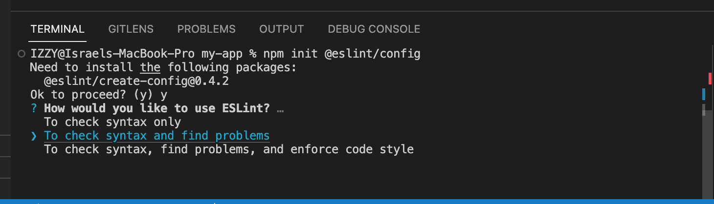
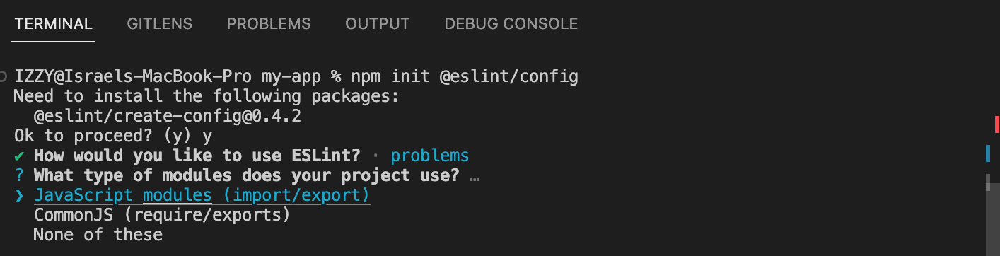
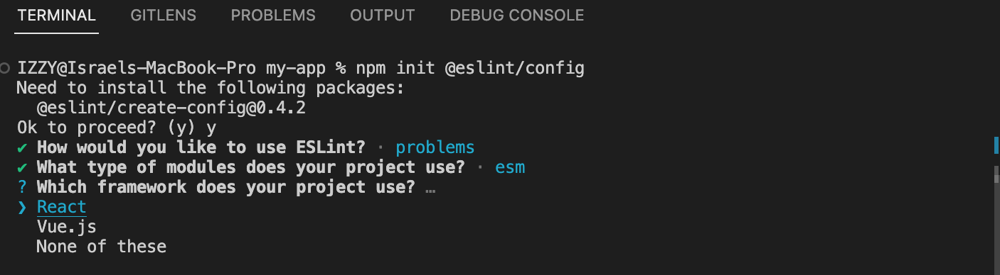
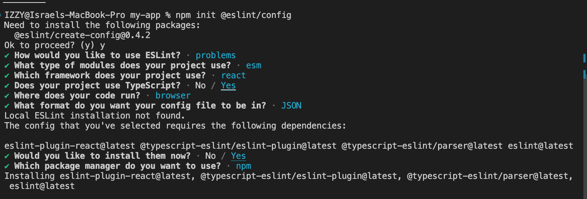
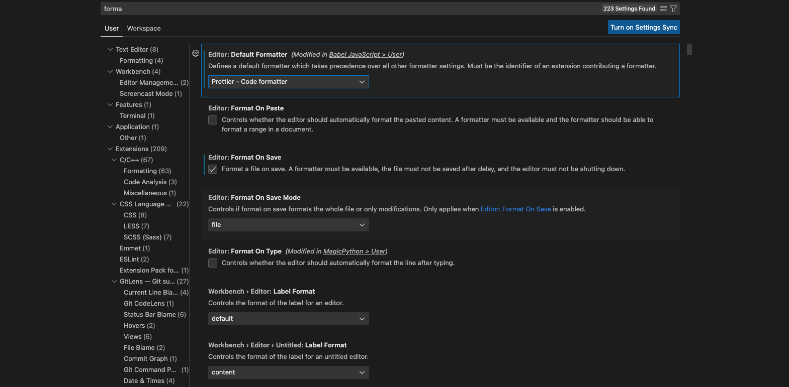

# Prettier-Linting-Husky-Setup-Guide

This readme File will be a step-by-step setup guide for ESLint with Pettier and Husky for Typescript React
Before Every Commit run the below command. This for the frontend only for backned with Node.js and TypeScript checkout SERVER-README.md in the server folder
To run linitng and check for errors
`
npm run lint
`
If there are any errors most can be fixed automatically by running 
`
npm run lint:fix 
`
In this tutorial Prettier will be ran automatically on when changes to a file is saved. But if you would like to run Prettier in the Cli use the command below
Be aware that this command is not one size fits all and you might need to change the path of the files Prettier is writing to depending on the file structure of your project 

`
prettier --write "./src/*.{ts,tsx,js,jsx}
`
# Step 1 Setting Up ESLint

1. Open the terminal in vscode and cd into the folder of your react-app Example below 
   `cd my-app`
2. Enter the below command in ther termianal to initalize eslint
   `npm init @eslint/config`
   `
   When asked How would you like to use ESLint Select

- To chek syntax and find problems
  
  Next Select "JavaScript modules (import/export)"
  When asked What type of modules does your project use?
  You can select "CommonJS" if you are creating a node project.
  

For The following prompt Select React

For the rest of the questions pick the answers show in the photo below

# Setting up Airbnb styleGudie for Eslinting

1. Setup regular Airbnb config
   `npm info "eslint-config-airbnb@latest" peerDependencies`

   `npx install-peerdeps --dev eslint-config-airbnb`
2. Install dependencies (and peer dependencies)
   `npm install eslint-config-airbnb-typescript \
            @typescript-eslint/eslint-plugin@^5.13.0 \
            @typescript-eslint/parser@^5.0.0 \
            --save-dev`
3. Configure ESLlint, Within your ESLint config file(.eslintrc.json):
   eslint-config-airbnb/hooks for react
   `{
    "env": {
        "browser": true,
        "es2021": true,
        "jest":true
    },
    "extends": [
        "react-app",
        "react-app/jest",
        "airbnb",
        "airbnb-typescript",
        "airbnb/hooks",
        "plugin:import/typescript"
    ],
    "overrides": [
    ],
    "parser": "@typescript-eslint/parser",
    "parserOptions": {
        "ecmaVersion": "latest",
        "sourceType": "module",
        "project": "./tsconfig.json"
    },
    "plugins": [
        "react",
        "@typescript-eslint"
    ],
    "rules": {
    }
}
### Imporant note make sure you are using the right file path for ./tsconfig.json because ESLint will throw errors if the path is wrong. SO edit the file path if necesary
`
4. With in your package.json 
`
scripts": {
    "start": "react-scripts start",
    "build": "react-scripts build",
    "test": "react-scripts test",
    "eject": "react-scripts eject",
    "lint": "eslint .",
    "lint:fix": "eslint --fix ."
  },
`

# Install Prettier and save as a dev dependency
Makes eslint know that prettier is in the project and works with ot
`
npm install prettier eslint-config-prettier eslint-plugin-prettier --save-dev
npm install --save-dev --save-exact prettier
`
If you try to run Prettier in the command line and it does not work. Install it Globally with npm and it should work then
 `
 npm install -g prettier
 `
### Add Prettier to .eslint.json : Updated part of the file below.
 Make sure to always have Prettier as the last plugin in the array so it's rules can override all others before it. 
 `
   "extends": [
        "react-app",
        "react-app/jest",
        "airbnb",
        "airbnb-typescript",
        "airbnb/hooks",
        "plugin:import/typescript",
        "plugin:prettier/recommended"
    ],
    "overrides": [
    ],
    "parser": "@typescript-eslint/parser",
    "parserOptions": {
        "ecmaVersion": "latest",
        "sourceType": "module",
        "project": "./tsconfig.json"
    },
    "plugins": [
        "react",
        "@typescript-eslint",
        "prettier"
    ],
 `
 # Make sure to create the Prettier configuration and have it in the root directory of your project  
 Filename .prettierrc 
`
{   "semi": true,    
    "tabWidth": 2,    
    "useTabs": false,     
    "singleQuote": true,      
    "bracketSpacing": true,     
    "printWidth": 100,     
    "htmlWhitespaceSensitivity": "ignore"  
}
`
Filename .prettierignore
ignore what you would like
Finally install the Prettier extension in vs code and changes the Format Setting to have Prettier as the default formatter and formats on save

# Adding eslint for the Poject
npm install eslint eslint-config-prettier eslint-plugin-prettier @typescript-eslint/eslint-plugin @typescript-eslint/parser

# Important NOTES 
# Acknowledges

This setup uses the Airbnb code style guide
This setup guide follows and documments the steps of setting ESLint with Pettier and Husky for Typescript React from Youtuber CoderOne's video [ESLint with VSCode, Prettier, Husky and React For Beginners](https://www.youtube.com/watch?v=ZXW6Jn6or1w) and Colt Steele  

